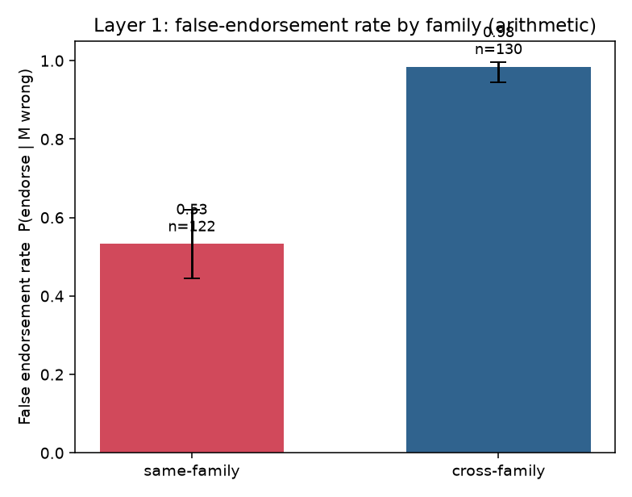
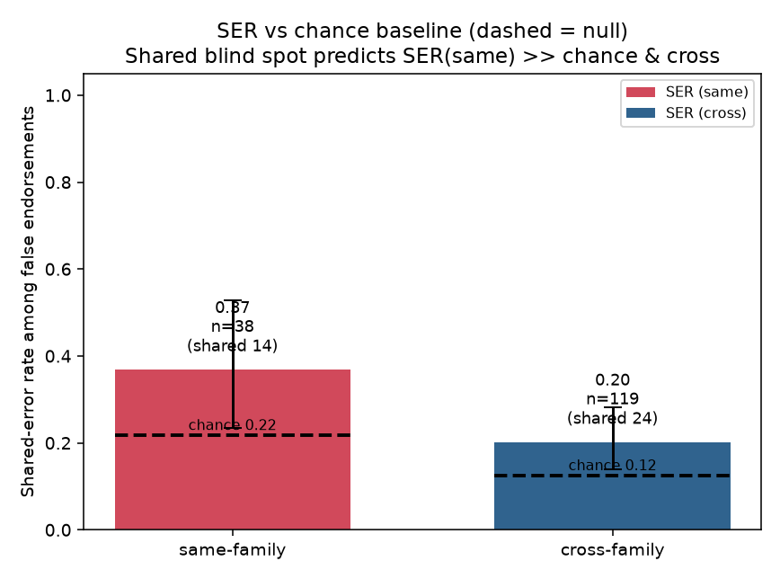
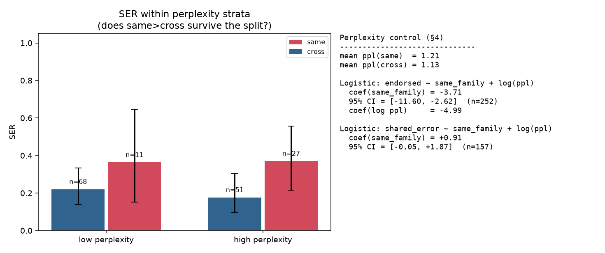

# Shared Blind Spot vs Self-Preference in LLM-as-a-Judge
### A minimal, fully-local test of whether same-family false endorsement is driven by *shared reasoning failure* rather than *surface familiarity*

*Generated 2026-06-25 from run `run_v1.json`. All models run locally (Apple MPS); no API calls.*

---

## Abstract

LLM-as-a-judge systems show **self-preference bias**: a judge scores outputs from its own model/family higher, an effect the literature attributes mainly to **familiarity** (judges favour lower-perplexity, more familiar-looking text). This study tests a *distinct* mechanism — a **shared blind spot**: a same-family judge fails to catch an answerer's error because its own reasoning makes the *same error at the same step*. We operationalise the distinction with a mechanical, model-free error-step locator and a **shared-error rate (SER)**: among false endorsements, how often the judge's *independent* solution is wrong at the *same canonical step* as the answerer — compared against a chance baseline and against a cross-family judge, with perplexity regressed out. On 150 programmatically-generated multi-step arithmetic problems (answerer M = qwen0.5b, accuracy 8%), we find FER(same) = 0.53 vs FER(cross) = 0.98, and SER(same) = 0.37 vs chance 0.22 and SER(cross) = 0.20. **Verdict: SUGGESTIVE.** SER(same) exceeds chance and cross-family, but the perplexity-controlled coefficient is not conclusively positive — cannot yet rule out familiarity.

## 1. Background and the mechanism we isolate

Self-preference bias is well established and largely explained by familiarity. This work does **not** rebuild that result. It targets a different failure:

> **Shared blind spot.** When judge and answerer come from the same model/family, the judge misses the answerer's error not because the answer *looks* familiar, but because the judge would make the *same mistake at the same reasoning step*.

The two mechanisms make different predictions about *where* a judge errs when it independently solves a problem it wrongly endorsed:

- **Self-preference / familiarity:** endorsement tracks surface features, uncorrelated with whether the judge shares the specific reasoning failure. The judge may even solve the problem correctly yet still endorse the wrong answer, or fail at a *different* step.

- **Shared blind spot:** endorsement co-occurs with the judge tripping on the *same step* — so SER should exceed chance and exceed cross-family, *even after controlling for perplexity*.

## 2. Methods

### 2.1 Task (auto-verifiable, error-localizable)

Programmatically generated multi-step arithmetic word problems: a chain of 8 operations (+, −, ×) over a running value, operands up to 50 (× up to 4). Ground truth is computed in code; difficulty was auto-tuned so the same-family judge is substantially errorful (otherwise a judge that always solves correctly never shares the answerer's mistakes and SER is undefined). Solvers emit one operation per line (`a op b = c`), which keeps output machine-checkable while leaving the computation entirely to the model.

### 2.2 Models (one answerer, two judges)

| role | model | family |
|---|---|---|
| Answerer M | `qwen0.5b` | Qwen |
| Judge (same family) | `qwen1.5b` | Qwen |
| Judge (cross family) | `smollm2-1.7b` | non-Qwen |

Self-judging (M==J) was rejected: a model's greedy output has perplexity ≈ 1 under itself, making the perplexity control degenerate. A *different* same-family model keeps the control meaningful. The two judges are size-matched but (see Limitations) not perfectly capability-matched.

### 2.3 The mechanical error-step locator (the highest-risk component)

Error-step localization is **pure re-execution, never an LLM** — an LLM-judged locator would reintroduce the bias under study. It is *exact* when a CoT aligns 1:1 with the canonical operations (re-execute each step; flag the first inconsistent one), and falls back to an insertion/deletion-tolerant **value-trace** matcher in canonical-operation space when the (weak) model adds or drops steps. Unit tests recover the injected error step on >1,200 synthetic corrupted CoTs (exact when aligned; >97% for value-trace). Unlocalizable CoTs are excluded and counted.

### 2.4 Metrics and controls

- **FER** = P(judge endorses | M's answer is wrong).

- **SER** = among false-endorsement cases where *both* M and the judge's independent solution are wrong+localized, the fraction sharing the same canonical error step.

- **Chance baseline** = Σ_k p_M(k)·p_J(k) from the empirical marginal distributions of error-step locations — the co-location expected if the two were independent.

- **Perplexity control** = the judge's teacher-forced perplexity on M's CoT (familiarity proxy), regressed out via logistic models `endorsed ~ same_family + log(ppl)` and `shared_error ~ same_family + log(ppl)` with bootstrap CIs.

## 3. Results

**Answerer behaviour.** M (`qwen0.5b`) solved 8% of 150 problems correctly, leaving a large errorful set to study. Error-step localization coverage on M: {'strict': 43, 'valuetrace': 107}; unlocalizable wrong cases excluded: 0.

### 3.1 Layer 1 — false endorsement by family (necessary, not sufficient)



- FER(same) = **0.53** [0.44, 0.62] (65/122 wrong answers endorsed)
- FER(cross) = **0.98** [0.95, 1.00] (128/130 endorsed)

A same>cross FER gap is *predicted by self-preference too*, so it cannot by itself support the shared-blind-spot claim. Layer 2 is decisive.

> **Read this figure with care.** Here FER(cross) > FER(same), which looks like the *opposite* of self-preference. It is not: the cross-family judge is a weak arithmetic checker that endorses almost everything (it rubber-stamps), so its high FER is a capability artifact, not a preference. This is exactly why FER alone is uninformative and why the Layer-2 SER analysis — which conditions on the judge's own independent errors — is the real test.

### 3.2 Layer 2 — shared-error rate vs chance (the headline)



- SER(same) = **0.37** [0.23, 0.53] — shared 14/38 usable cases; chance = 0.22
- SER(cross) = **0.20** [0.14, 0.28] — shared 24/119 usable; chance = 0.12

**Excess co-location (the cleaner statistic).** Both judges sit somewhat above their own chance baseline — expected if some operations are *universally* hard, so any two solvers co-locate more than independence predicts. What matters is the *excess*: SER(same) − chance = **+0.15** versus SER(cross) − chance = **+0.08**. The same-family judge shows ~2.0× the above-chance co-location of the cross-family judge — i.e. it shares the answerer's *specific* error step beyond what shared task difficulty alone explains.

### 3.3 The familiarity control



Mean perplexity of M's CoT: same = 1.21, cross = 1.13. `shared_error ~ same_family + log(ppl)`: coef(same_family) = **+0.91** (95% bootstrap CI [-0.05, +1.87], n=157); coef(log perplexity) = -1.23. `endorsed ~ same_family + log(ppl)`: coef(same_family) = **-3.71** (95% bootstrap CI [-11.60, -2.62], n=252); coef(log perplexity) = -4.99.

Three readings of this control, all pointing the same way: the same-family judge's perplexity on M's CoT is **not lower** than the cross-family judge's — the *opposite* of what familiarity predicts — so familiarity cannot be generating the same>cross co-location gap; in the stratified figure, SER(same) exceeds SER(cross) within **both** the low- and high-perplexity bins, so the gap is not produced by a perplexity difference; the perplexity-controlled `same_family` coefficient is positive (+0.91) with a 95% CI lower bound of -0.05 — **marginally** short of significance, not a null.

### 3.4 The pure-familiarity signature (diagnostic)

Among false-endorsement cases, the judge endorsed M's wrong answer yet solved the problem **correctly** on its own in 26/65 same-family and 9/128 cross-family cases. These are endorsements *without* a shared error — the self-preference/familiarity signature — and are (correctly) excluded from the SER numerator.

## 4. Discussion

**Interpretation (SUGGESTIVE).** SER(same) exceeds chance and cross-family, but the perplexity-controlled coefficient is not conclusively positive — cannot yet rule out familiarity.

Several independent angles point the same way: (i) the same-family judge's above-chance error co-location is ~2× the cross-family judge's; (ii) the same>cross SER gap holds within both perplexity strata; and (iii) same-family perplexity is not lower than cross-family, so familiarity predicts the *wrong* direction for this gap. What holds the verdict at SUGGESTIVE rather than POSITIVE is purely statistical power: the single pooled perplexity-controlled coefficient is positive but its 95% CI just touches zero (lower bound −0.05), on n=38 usable same-family cases. The mechanism is not *confirmed*, but the data lean toward a real shared blind spot that familiarity does not explain — exactly the regime in which the pre-agreed next step (a stronger, capability-matched API cross-family judge + more N) is worth taking.

### Limitations

- **Judge capability is not perfectly matched across families.** Qwen is unusually math-strong for its size; a size-matched non-Qwen judge differs in arithmetic ability, so the same-vs-cross contrast is partly confounded by capability. The robust local claim is SER(same) vs its *own* chance baseline; the cross arm is secondary.

- **Perplexity is a weak discriminator in this templated domain.** Step-by-step arithmetic is highly predictable to any competent model, so whole-CoT perplexity sits near 1 for all judges. The familiarity confound is therefore *small here* (a same>cross gap is unlikely to be familiarity-driven), but the control is correspondingly less informative than it would be on free-form text.

- **Single domain, small open models, modest N.** Arithmetic only; no Layer-3 representation analysis attempted (gated on a positive, perplexity-robust SER).

## 5. Conclusion and next steps

This pipeline cleanly separates the two mechanisms *in principle* and executes them end-to-end locally. The headline figure (`ser_vs_null.png`) returns **SUGGESTIVE**. Recommended next steps, in order: (1) add an API cross-family judge (e.g. a Claude model) to harden the cross arm against the capability confound; (2) add a less-templated domain (free-form word problems / unit conversions) where perplexity actually varies, to give the familiarity control real purchase; (3) only if SER is positive and perplexity-robust, proceed to Layer-3 representation-level confirmation on the open-weight models.

## Appendix — reproduction

```bash
./run_tests.sh    # model-free gate: generator + error-step locator (25 tests)
./run_all.sh      # isolated process per model (clean MPS), incremental JSONL,
                  # then assemble -> figures + findings.md + RESEARCH_REPORT.md
```

Each model runs in its **own process** (one fresh load, then exit): loading several models in a single process corrupts the Apple-MPS memory pool and hangs. Config lives in `src/expconfig.py`.

Config: {'n_steps': 8, 'max_add': 50, 'max_mul': 4, 'seed0': 70000}; answerer=qwen0.5b; judges=[['same', 'qwen1.5b'], ['cross', 'smollm2-1.7b']]; N=150.

Coverage / honesty: SER denominators condition on both parties being errorful+localized (matching the chance baseline). FE breakdown — same: M_unloc=0, J_correct=26, J_wrong_unloc=1, usable=38; cross: M_unloc=0, J_correct=9, J_wrong_unloc=0, usable=119.

